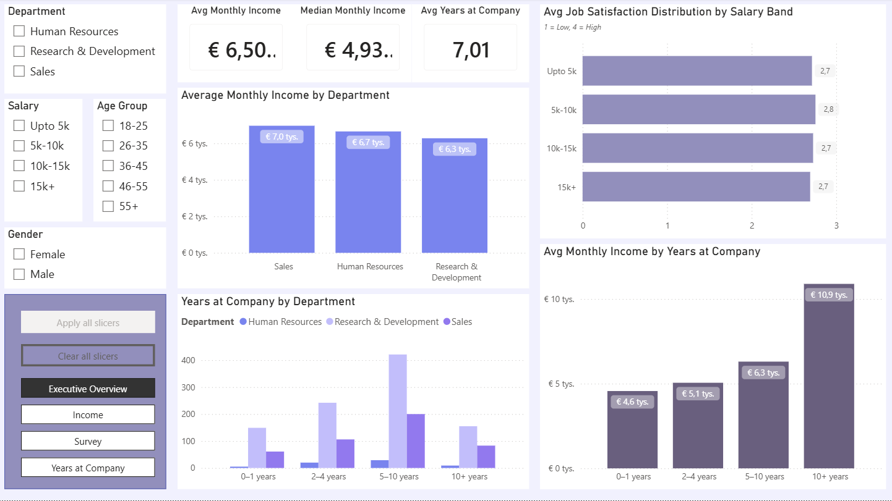
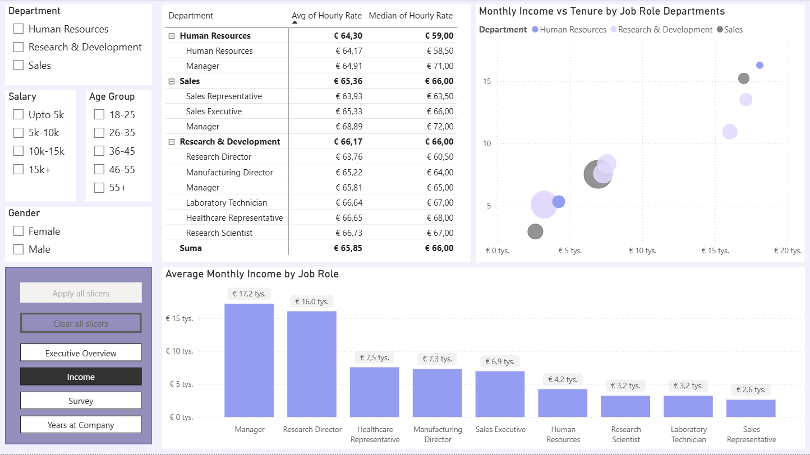
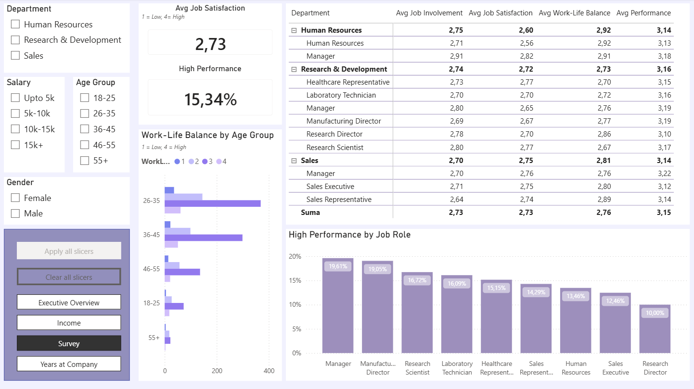
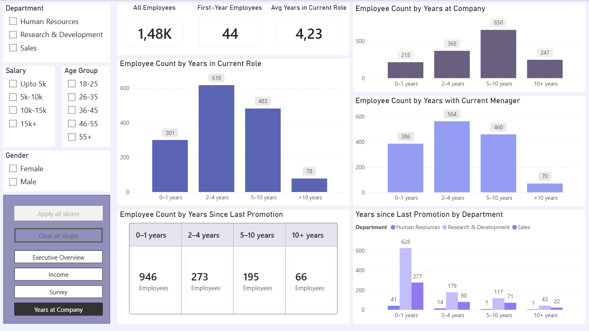

# HR Analytics Dashboard – Power BI

This is a Power BI portfolio project where I worked with an HR dataset and built a report around employee income, job satisfaction, years at company and promotion-related patterns.

## What I wanted to find out

The main questions behind the report were:

- How is income different between departments and job roles?
- Which roles have the highest average monthly income?
- How do job involvement, satisfaction, work-life balance and performance compare across departments and job roles?
- How long do employees usually stay in the company, in their role, and with the same manager?
- What does the distribution of years since last promotion look like?

## Report pages

### Executive Overview

The first page gives a quick summary of the main HR metrics.

It includes:
- average monthly income
- median monthly income
- average years at company
- job satisfaction by salary band
- years at company by department
- average monthly income by tenure group

This page is meant to give a fast overview before going into more details.

### Income

This page focuses on compensation.

I used it to compare:
- average and median hourly rate by department and job role
- average monthly income vs average years at company by job role department
- monthly income by job role

The biggest goal here was to make income differences easier to compare across roles and departments.

### Survey

This page looks at employee experience.

It includes:
- average job satisfaction
- high performance rate
- work-life balance by age group
- a matrix with average job involvement, satisfaction, work-life balance and performance
- high performance by job role

I used this page to compare satisfaction, work-life balance, involvement, and performance across employee groups.

### Years at Company

This page focus on career history.

It includes:
- total employees
- first-year employees
- average years in current role
- employee count by years at company
- employee count by years in current role
- employee count by years with current manager
- years since last promotion
- years since last promotion by department

I grouped the year-based fields into bands to better compare time at company, time in role, and promotion history.

## What I used

- Power BI
- DAX
- Power Query
- calculated columns
- measures
- slicers
- matrix visuals
- grouped categories and custom sorting

## Some things I practiced in this project

- building a multi-page Power BI report
- creating cleaner category groups, like salary bands and tenure groups
- sorting text-based groups in the correct order
- building matrix views for easier comparison across departments and roles
- keeping report pages focused on one topic
- making the report labels clearer and more consistent

## A few observations from the dashboard

- Manager and Research Director roles show the highest average monthly income.
- Many employees have been with the company for 5–10 years, making this one of the most visible experience groups in the dashboard.
- Survey scores are quite close across departments, so role-level differences are more interesting to look at.
- Many employees are in the 0–1 years since last promotion group, meaning their last promotion was recent.

## Files in this repository

- `HR Analytics.pbix` – Power BI report
- `screenshots/` – dashboard screenshots
- `README.md` – project notes

## Notes

This is a portfolio project, so the main goal was practice: report structure, visual choices, DAX, grouping logic and presenting HR data in a clearer way.

I’m still improving my Power BI skills, so feedback is welcome.
